# TPU Perf Model v2: Chinese Output + Mermaid Pipeline Diagram

**Date**: 2026-04-15

## Problem

Two gaps in the current TPU perf model output:

1. The SKILL.md doesn't instruct the agent to write analysis conclusions in Chinese, making it less accessible for Chinese-speaking users.
2. There is no visual pipeline diagram showing how tiles overlap across DMA/MXU/VPU resources over time. The textual timeline is hard to parse for understanding overlap patterns.

## Design

### Change 1: SKILL.md Chinese Output Directive

Add a language directive to SKILL.md requiring the agent to write its final analysis narrative in Chinese. This does NOT change the CLI tool output (which remains English with numeric data). Only the agent's interpretive prose is affected.

**Where to add**: New "Output Language" section after "Required Output Sections", stating:
- All section headers, bottleneck diagnoses, optimization hints, and summary conclusions must be written in Chinese
- Technical terms (HBM, VMEM, MXU, VPU, DMA, FLOPS) remain in English
- Numeric data, formulas, and code remain unchanged

### Change 2: Mermaid Gantt Pipeline Diagram via CLI

Add `--mermaid` flag to `cli.py` that outputs a Mermaid Gantt chart showing the tile pipeline schedule. Only available in `--analysis-level micro` mode.

#### Data source

Reuse the existing `ScheduleResult` from `schedule_micro_op_graph()`. Each `MicroOp` has:
- `op_id` (contains step name, op kind, tile index)
- `start_ns` / `end_ns` from `OpTiming`
- `required_units` -> determines which section (DMA / MXU / VPU)

#### Tile display strategy

Show **startup + steady-state pattern**:
- Display the first 3 tiles fully (ramp-up phase where overlap develops)
- After tile 2, if more tiles exist, add a comment line `%% ... tiles 3-{N-1} follow steady-state pattern ...`
- Configurable via `--max-tiles N` (default 3)

#### Mermaid output structure

```mermaid
gantt
    title Tile Pipeline: {step_names}
    dateFormat x
    axisFormat %s ns
    section DMA
        load_Q_t0 :0, 100
        load_K_t0 :0, 100
        store_t0  :350, 450
        load_Q_t1 :100, 200
    section MXU
        matmul_t0 :150, 300
        matmul_t1 :300, 450
    section VPU
        softmax_t0 :300, 350
```

#### Implementation location

New function `micro_schedule_to_mermaid(schedule, graph, max_tiles=3)` in `micro_op_report.py`.

Logic:
1. Extract all unique resource units from `schedule.resource_occupancy` keys (format: `{UNIT}:{idx}`)
2. Group micro-ops by unit type (DMA, MXU, VPU) using each op's `required_units`
3. Filter to ops whose `op_id` contains `tile0`, `tile1`, or `tile2` (up to `max_tiles`)
4. Sort ops within each section by `start_ns`
5. Format as Mermaid gantt with `dateFormat x` (millisecond timestamps)
6. Append ellipsis comment if total tiles > max_tiles

#### CLI integration

In `cli.py`:
- New `--mermaid` flag
- When `--analysis-level micro` and `--mermaid`: print the Mermaid block after the main micro-op report
- If `--analysis-level step` with `--mermaid`: error message saying micro mode required

#### SKILL.md update

Add instruction requiring the agent to always run with `--mermaid` flag when using micro-op analysis, and to include the Mermaid diagram in its output.

### Files to modify

| File | Change |
|------|--------|
| `micro_op_report.py` | Add `micro_schedule_to_mermaid()` |
| `cli.py` | Add `--mermaid` and `--max-tiles` args, call new function |
| `SKILL.md` | Add Chinese output directive + Mermaid diagram instruction |
| `test_micro_op_report.py` | Test the new Mermaid function |

### What we are NOT doing

- Not adding i18n/l10n to the CLI tool itself
- Not changing existing text/JSON output formats
- Not creating a separate rendering module
- Not supporting step-level Mermaid (only micro-op mode has the timing data needed)
