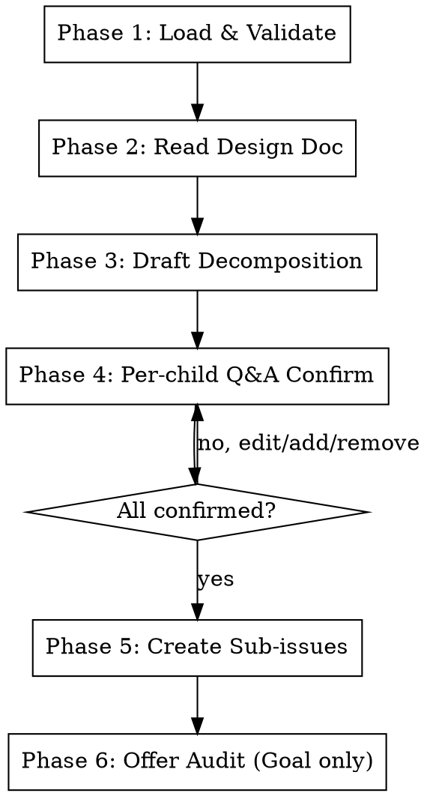

# Beaver Decompose

Decompose a `Goal` Issue into `Task` sub-issues (size/L), or a `Task` Issue into `SubTask` sub-issues (size/S). Reads a required design doc, drafts the decomposition, confirms each child issue with the user one at a time, then creates them via `gh api`.

**References beaver-engine for:** label ops (Section 4), state machine (Section 2), guardrails G001 (Section 3), transition execution (Section 6).

## Prerequisites

- `gh auth status` must succeed
- Project scope: `gh auth refresh -s project` if missing
- Both arguments required:
  - `<owner/repo#issue-number>` — the parent Issue to decompose
  - `--design-doc <url>` — URL or local path to the design document

## Decomposition Mapping (fixed)

| Parent type | Child type | Child size | Child initial status |
|---|---|---|---|
| `Goal` | `Task` | `size/L` | `status/triage` → auto-transition to `status/design-pending` |
| `Task` | `SubTask` | `size/S` | `status/triage` (kept; no auto-transition) |

Level is determined by the GitHub native issue type field (`gh api ... --jq '.type.name'`).

## Workflow



---

## Phase 1: Load & Validate

### Step 1: Parse arguments

Extract `owner`, `repo`, `issue_number` from the first positional arg (format `owner/repo#number`). Extract `design_doc_url` from `--design-doc <url>`.

If either is missing or malformed, stop and inform user:
- "Usage: beaver-decompose <owner/repo#number> --design-doc <url>"

### Step 2: Fetch parent issue

```bash
gh api repos/{owner}/{repo}/issues/{number} \
  --jq '{title, body, state, type: (.type.name // null), labels: [.labels[].name]}'
```

### Step 3: Validate parent

Parse labels per engine Section 4. Verify:
- `state == "open"` — else stop: "Parent issue is closed; cannot decompose."
- `type` ∈ {`Goal`, `Task`} — else stop: "beaver-decompose only supports Goal or Task issues. This issue type is `{type}`."
- If `type == "Task"`: must have `status/ready-to-develop` label — else stop: "Task issues must be in status/ready-to-develop before decomposition. Current status: {status}. Run beaver-design-doc first if needed."

### Step 4: Fetch existing sub-issues (do not block)

```bash
gh api repos/{owner}/{repo}/issues/{number}/sub_issues \
  -H "X-GitHub-Api-Version: 2026-03-10" \
  --jq '.[] | {number, title, state, body_summary: (.body | .[0:200])}'
```

Collect OPEN sub-issues into the "already covered" set. This set is passed to Phase 3 — existing sub-issues are NEVER modified, only the uncovered scope is generated.

If the API returns empty or errors with 404 (no sub-issues yet), continue with empty set.

---

## Phase 2: Read Design Doc

Resolve `--design-doc <url>` based on form:

### Case A: GitHub PR URL (e.g. `https://github.com/primatrix/wiki/pull/123`)

```bash
# Get the PR's changed markdown files
gh pr view {url} --json files --jq '.files[] | select(.path | endswith(".md")) | .path'
# Then read the file from the PR's head ref
gh pr view {url} --json headRefName,headRepository --jq '.'
gh api repos/{head_owner}/{head_repo}/contents/{path}?ref={head_ref} --jq '.content' | base64 -d
```

### Case B: GitHub blob URL (e.g. `https://github.com/primatrix/wiki/blob/main/docs/designs/X.md`)

Convert to API form:
```bash
gh api repos/{owner}/{repo}/contents/{path}?ref={branch} --jq '.content' | base64 -d
```

### Case C: Local path (e.g. `~/Code/wiki/docs/designs/X.md`)

```bash
cat {expanded_path}
```

### Failure handling

If fetch fails (404, network error, file missing): stop with the specific error. Do NOT proceed to Phase 3 — drafting without a design doc is forbidden.

Store the full design doc text in memory; it is the primary input to Phase 3.

---

## Phase 3: Draft Decomposition

### Step 1: Build LLM input context

Concatenate:
- Parent Issue title + body (目标 + 验收标准)
- Full design doc text (from Phase 2)
- "Already covered" set from Phase 1, Step 4 — list of `{number, title, body_summary}`

### Step 2: Generate draft

Produce a draft list of children. Constraints:

- **Goal → Task**: each Task aligns to a component / module / phase named in the design doc. Use design doc section titles as the basis for Task scoping.
- **Task → SubTask**: each SubTask must have:
  - A complete functional description (what it does, inputs/outputs)
  - An end-to-end test plan (test path: input → execution → expected output, plus framework/command, plus test file location)
- **Coverage rule**: explicitly skip any scope that the "already covered" set addresses. If a draft Task overlaps with an existing OPEN sub-issue, drop it.
- **No LOC constraint at this phase** — `beaver-pr` G005 enforces 200 LOC at PR creation time.

### Step 3: Set defaults

For each draft child:
- `type/{label}`: inherit from parent (e.g. parent has `type/feat` → child has `type/feat`)
- `p*/{priority}`: inherit from parent
- `size/{L|S}`: from mapping table (Goal→L, Task→S)

User can override per item in Phase 4.

### Step 4: Render draft to user

Present in two parts:

```markdown
### Skipped (already covered by existing sub-issues)

- #{n} {title} — covers: {one-line summary}
- #{n} {title} — covers: {one-line summary}

### Drafted children

| # | Title | Type | Size | Priority | One-line scope |
|---|-------|------|------|----------|----------------|
| 1 | {title} | type/feat | size/L | p2/high | {scope} |
| 2 | ... | ... | ... | ... | ... |
```

Then announce: "Next, I will walk through each drafted child one at a time for your confirmation."

---

## Phase 4: Per-child Q&A Confirm

Iterate the draft list in order. For each item, render the FULL proposed issue body (using templates from "Issue Body Templates" section below) and prompt:

> Child #{i} of {N}: **{title}**
>
> [render full body]
>
> Choose action:
> - **accept** → keep as-is, move to next
> - **edit** → describe the change, I will rewrite and re-prompt
> - **delete** → drop this child entirely
> - **insert** → insert a new child at this position (collect title + body)

### Rules

- One item at a time. Do NOT batch multiple confirmations.
- After **edit**: rewrite the full body, re-render, re-prompt. Loop until accept/delete.
- After **insert**: collect new child via Q&A (title, type override?, priority override?, full body), then re-prompt the original item.
- After **delete**: do not store this item; move to the next.
- After all items processed, show final summary table:

```markdown
### Final decomposition (will be created)

| # | Title | Type | Size | Priority |
|---|-------|------|------|----------|
| ... | ... | ... | ... | ... |
```

Ask: "Create these {N} sub-issues now? (yes/no)"

If user says no: stop without creating anything. If yes: proceed to Phase 5.

---

## Phase 5: Create Sub-issues

For each confirmed child, sequentially execute:

### Step 1: Write body to temp file

```bash
BODY_FILE=$(mktemp)
cat > "$BODY_FILE" << 'BEAVEREOF'
{rendered_body}
BEAVEREOF
```

### Step 2: Create the issue

```bash
CHILD_URL=$(gh api repos/{owner}/{repo}/issues --method POST \
  -H "X-GitHub-Api-Version: 2026-03-10" \
  -f title="{child_title}" -F body=@"$BODY_FILE" \
  -f type="{Task|SubTask}" \
  -f "labels[]=Control-By-Beaver" \
  -f "labels[]=type/{type}" \
  -f "labels[]=size/{L|S}" \
  -f "labels[]={priority}" \
  -f "labels[]=status/triage" \
  --jq '.html_url')
```

If issue type API fails, retry without `-f type`.

### Step 3: Capture child id and link to parent

```bash
CHILD_NUMBER=$(echo "$CHILD_URL" | awk -F/ '{print $NF}')
CHILD_ID=$(gh api repos/{owner}/{repo}/issues/$CHILD_NUMBER --jq '.id')

gh api repos/{owner}/{repo}/issues/{parent_number}/sub_issues \
  --method POST -H "X-GitHub-Api-Version: 2026-03-10" \
  -F sub_issue_id=$CHILD_ID
```

> **NOTE:** Use `-F` (capital, `--field`) for `sub_issue_id` because it must be an integer. `-f` would send a string and 422.

### Step 4: Add to Project V2

```bash
gh project item-add {projectNumber} --owner {org} --url "$CHILD_URL" --format json
```

Then `gh project item-edit` to set Level={Task|SubTask}, Status=Not Started, Progress=0 (per `beaver-issue` Step 6).

### Step 5: Auto-transition (Goal→Task only)

If parent was a Goal (this child is a Task / size/L):
- Execute transition `status/triage` → `status/design-pending` per engine Section 6 (validates G001)

If parent was a Task (this child is a SubTask / size/S):
- Keep `status/triage` — do NOT auto-transition. Claim mode in `beaver-issue` will move to in-progress when a developer picks it up.

### Step 6: Cleanup

```bash
rm "$BODY_FILE"
```

### Failure handling

| Failure point | Action |
|---|---|
| Issue create fails | Stop the loop. Report: "Created {i-1}/{N}; failed at {i}: {error}". Do NOT roll back created issues. |
| Sub-issue link fails (issue created) | Report the orphan child URL. Continue to next item. User can manually link or rerun. |
| Project item-add fails | Warn, do not stop. Report URL with note "manually add to project". |
| Status transition fails | Warn, do not stop. Report which child needs manual transition. |

---

## Phase 6: Offer Audit & Report

### Step 1: Print summary

```markdown
## Decomposition Complete

Parent: {owner}/{repo}#{parent_number} ({Goal|Task})
Created: {N} {Task|SubTask} sub-issues

| # | URL | Status |
|---|-----|--------|
| 1 | {url} | created + linked + project added |
| ... | ... | ... |

Skipped (already covered): {count}
Failures: {count, with details}
```

### Step 2: Offer audit (Goal → Task only)

If parent was a `Goal`:

> Decomposed Goal #{n} into {N} Tasks. Run `beaver-audit {parent_number}` now to verify coverage, atomicity, and test definitions? (yes/no)

If yes: invoke beaver-audit on the parent issue number.
If no: stop; remind user they can run it manually later.

If parent was a `Task`: skip the audit prompt entirely (`beaver-audit` only targets size/L parents).

---

## Issue Body Templates

### Goal → Task child

```markdown
## 目标

{从 design doc 提炼的该 Task 的目标 — 完整一段}

## 验收标准

- {可验收要点 1}
- {可验收要点 2}
- ...

## 设计参考

- Parent: #{parent_number}
- Design Doc: {design_doc_url}
- 相关章节: {design doc 中与本 Task 对应的章节标题}

<!-- beaver-tracking
repos:
  - {repo}
paths:
  - {path1}
keywords:
  - {keyword1}
-->
```

### Task → SubTask child

```markdown
## 目标

{该 SubTask 完整的功能描述 — 输入、行为、输出}

## 验收标准

- {可验收要点 1}
- {可验收要点 2}

## 端到端测试方案

- 测试路径: {输入 → 执行 → 期望输出}
- 测试框架/命令: {pytest / go test / ...}
- 测试文件位置: {path/to/test_file}

## 设计参考

- Parent: #{parent_number}
- Design Doc: {design_doc_url}
- 相关章节: {对应章节}

<!-- beaver-tracking
repos:
  - {repo}
paths:
  - {path1}
keywords:
  - {keyword1}
-->
```

---
