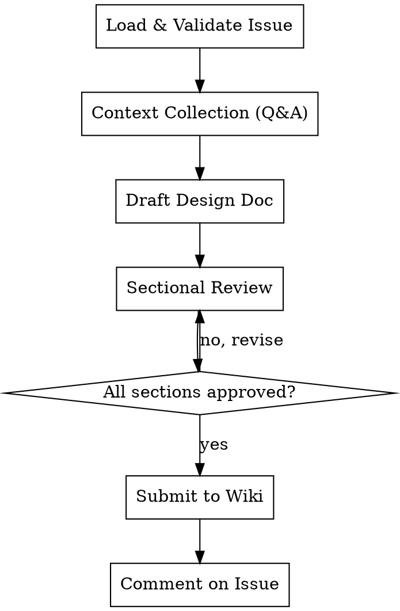

# Beaver Design Doc

Write a design document for a size/L issue in `status/design-pending`. Collects design details through iterative Q&A, writes a structured design doc, submits it as a PR to primatrix/wiki, and comments on the original issue.

**References beaver-engine for:** label ops (Section 4), state machine validation (Section 2).

## Prerequisites

- `gh auth status` must succeed
- Argument required: `owner/repo#issue-number`

## Workflow



---

## Phase 1: Load & Validate Issue

### Step 1: Parse argument

Extract `owner`, `repo`, and `issue_number` from the argument. Format: `owner/repo#number`.

If the argument does not match this format, stop and inform user:
- "参数格式错误，请使用 owner/repo#number 格式。例如: primatrix/myproject#42"

### Step 2: Fetch issue

```bash
gh api repos/{owner}/{repo}/issues/{number} --jq '{title, body, state, labels: [.labels[].name]}'
```

### Step 3: Validate labels

Parse labels per engine Section 4. Verify:
- Has `size/L` label
- Has `status/design-pending` label

If either is missing, stop and inform user:
- Missing `size/L`: "该 issue 不是 size/L，design-doc 仅适用于 size/L issue。"
- Missing `status/design-pending`: "该 issue 当前状态不是 design-pending，无法开始设计文档。当前状态: {current_status}"

### Step 4: Extract context from issue body

Parse 目标 and 验收标准 from the issue body. Display to user as starting context.

---

## Phase 2: Context Collection (Iterative Q&A)

<HARD-GATE>
Do NOT skip Q&A. Do NOT "derive reasonable assumptions" from the issue body. Do NOT draft any design content until ALL 4 sections have been explored through Q&A with the user. The issue body is a starting point, NOT sufficient input for a design doc.
</HARD-GATE>

**通用规则:**
- 每次只问一个问题
- Agent 必须先主动搜索代码库（现有架构、相关文件、测试基础设施等），基于搜索结果提问
- 持续要求用户补充 context — 每个 section 都应询问是否有相关文档、代码、设计可以参考
- 鼓励用户使用 @ 引用文件或粘贴相关内容
- 当前 section 不清晰前不进入下一个
- 全程使用中文
- 不得编造技术细节（库名、框架、架构组件）— 所有技术决策必须来自用户输入
- 不可在缺乏 context 的情况下跳过问题或做假设
- 每个设计决策都要追问 trade-off — "为什么选这个而不是其他方案"

按以下 4 个 section 逐一收集信息。每个 section 不预设固定问题列表，而是根据已收集的信息和代码库搜索结果动态决定下一个问题:

### Section 1: 背景与范围 (Context & Scope)

**目标:** 理解项目所处环境和边界，建立客观背景事实

**切入点:**
- 从 issue body 中提取的上下文开始
- 主动搜索代码库中相关的文件、模块、依赖
- 追问缺失的背景信息

**完成标准:** 读者能仅凭此 section 理解新系统将在什么环境中构建，以及构建什么。简洁、客观、事实导向。

### Section 2: 设计目标 (Goals & Non-goals)

**目标:** 明确 goals、non-goals、成功指标

**切入点:**
- 区分"想做什么"和"选择不做什么"
- Non-goals 不是否定目标（如"系统不应崩溃"），而是可以合理成为目标但明确选择不做的事
- 追问成功指标的具体量化方式

**完成标准:** Goals 覆盖用户场景，Non-goals 边界清晰，成功指标可衡量。

### Section 3: 设计方案 (The Design)

**目标:** 架构、组件、接口、数据流、trade-offs，以及轻量的测试策略和部署依赖

**切入点:**
- 先搜索并要求用户提供现有系统信息（架构、代码结构、技术栈）
- 探讨新组件在现有系统中的位置（系统上下文图）
- 技术选型及理由
- 接口概要、数据存储方式、数据流转路径
- 关键 trade-offs — 每个设计决策都要问"为什么选这个"
- 轻量覆盖测试策略（关键测试路径、mock 策略）
- 轻量覆盖部署与依赖（部署方式、外部依赖）

**重点:** 聚焦 trade-offs。设计文档的核心价值在于记录你在设计中做出的权衡。给定背景（事实）和目标（需求），设计方案应展示为什么特定方案最好地满足了这些目标。

**完成标准:** 架构边界清晰、选型有理由、trade-offs 明确记录、测试和部署有轻量覆盖。

### Section 4: 备选方案 (Alternatives Considered)

**目标:** 收集用户考虑过的其他方案及其放弃理由

**切入点:**
- "在确定这个方案之前，你考虑过哪些其他方案？"
- 每个备选方案的 trade-off 是什么
- 为什么当前方案在给定目标下更优

**完成标准:** 读者看完后能理解为什么当前方案最优，以及其他看似可行的方案为什么不够好。

---

## Phase 3: Draft & Sectional Review

### Step 1: Write complete design doc

Based on all collected information, write the design doc using the template below.

### Step 2: Present each section for approval

Present each of the 4 sections individually. For each section:
- Show the section content
- Ask: "这个 section 是否准确？需要修改吗？"
- If user requests changes, revise and re-present
- Only proceed to next section after approval

### Step 3: Final confirmation

After all sections approved, show full document and ask for final confirmation.

---

## Phase 4: Submit to Wiki

### Step 1: Prepare wiki repo

```bash
# If ~/Code/wiki exists, check clean state and pull latest
if [ -d ~/Code/wiki ]; then
  if [ -n "$(git -C ~/Code/wiki status --porcelain)" ]; then
    echo "~/Code/wiki has uncommitted changes. Please commit or stash before proceeding."
    exit 1
  fi
  git -C ~/Code/wiki checkout main && git -C ~/Code/wiki pull
else
  gh repo clone primatrix/wiki ~/Code/wiki
fi
```

### Step 2: Create branch

Generate slug from issue title (lowercase, hyphens, no special chars).

```bash
git -C ~/Code/wiki checkout -B design/{issue_number}-{slug}
```

### Step 3: Write design doc

Ensure the `docs/designs/` directory exists, then write the design doc:
```bash
mkdir -p ~/Code/wiki/docs/designs
```

Write to: `~/Code/wiki/docs/designs/YYYY-MM-DD-{issue-slug}.md`

### Step 4: Commit and push

```bash
git -C ~/Code/wiki add docs/designs/YYYY-MM-DD-{issue-slug}.md
git -C ~/Code/wiki commit -m "docs: add design doc for {owner}/{repo}#{number}"
git -C ~/Code/wiki push -u origin design/{issue_number}-{slug}
```

### Step 5: Create PR

```bash
PR_BODY_FILE=$(mktemp)
cat > "$PR_BODY_FILE" << 'EOF'
## 设计文档

关联 Issue: {owner}/{repo}#{number}

### 概要
{one-paragraph summary of the design}

🤖 Generated with [Claude Code](https://claude.com/claude-code)
EOF

gh pr create --repo primatrix/wiki \
  --title "Design: {issue_title}" \
  --body-file "$PR_BODY_FILE"

rm "$PR_BODY_FILE"
```

### Step 6: Comment on original issue

```bash
BODY_FILE=$(mktemp)
cat > "$BODY_FILE" << 'BEAVEREOF'
设计文档已提交: {PR_URL}

请在 PR 中 review 设计文档。Review 通过后，请将此 issue 状态从 `status/design-pending` 转为 `status/ready-to-develop`。
BEAVEREOF

gh api repos/{owner}/{repo}/issues/{number}/comments \
  --method POST -F body=@"$BODY_FILE"

rm "$BODY_FILE"
```

### Step 7: Report

Print summary: PR URL, design doc path, issue status (remains `design-pending`).

---

## Design Doc Template

```markdown
---
issue: {owner}/{repo}#{number}
title: {issue_title}
date: {YYYY-MM-DD}
status: design-pending
---

# {Issue Title} 设计文档

## 1. 背景与范围

{客观背景事实。新系统所处的技术环境，正在构建什么。简洁，不含观点。}

## 2. 设计目标

### 2.1 Goals
{目标列表}

### 2.2 Non-Goals
{可以合理成为目标但明确选择不做的事。不是否定目标。}

### 2.3 成功指标
{如何衡量设计的成功}

## 3. 设计方案

### 3.1 系统上下文图
{新系统在更大技术版图中的位置，帮助读者将新设计放入已熟悉的环境中理解}

### 3.2 核心架构
{关键组件、系统边界、技术选型及理由}

### 3.3 接口与数据流
{API 概要（避免粘贴完整接口定义，聚焦与设计 trade-off 相关的部分）、数据存储方式、模块间数据流转}

### 3.4 Trade-offs
{设计中做出的关键权衡及其理由。这是设计文档的核心价值。}

### 3.5 测试策略
{关键测试路径、mock 策略 — 简要描述}

### 3.6 部署与依赖
{部署方式、外部依赖 — 简要描述}

## 4. 备选方案

{其他可行方案及其 trade-off。聚焦每个方案的权衡，以及为什么当前方案在给定目标下更优。}
```

## Red Flags — STOP If You Catch Yourself Thinking

| Thought | Reality |
|---------|---------|
| "Issue body has enough info to start drafting" | Issue body is a starting point. Q&A surfaces constraints, tradeoffs, and context you can't infer. |
| "I'll derive reasonable assumptions" | Assumptions in a design doc become wrong decisions. Ask, don't assume. |
| "The user seems busy, let me just write it" | A bad design doc wastes more time than Q&A. Keep asking. |
| "I can fill in the technical details myself" | You don't know the team's tech stack, infra constraints, or preferences. Ask. |
| "This section is obvious, I'll skip the questions" | Every section has hidden constraints. Ask anyway. |
| "I'll ask all questions at once to save time" | One question at a time. Batching overwhelms and gets shallow answers. |
| "I can derive the trade-offs from the code" | Trade-offs are design decisions, not code facts. They must come from the user. Ask. |

## Constraints

- Argument is required (must provide owner/repo#issue-number)
- Issue must have `size/L` + `status/design-pending` labels
- Design doc content in Chinese (中文)
- One question at a time during Q&A
- All sections must be individually approved before submission
- Issue status stays at `design-pending` — no automatic transition
- Wiki repo cloned to fixed path `~/Code/wiki`
