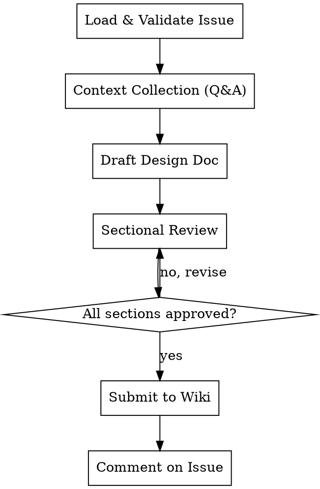

# Beaver Design Doc

Write a design document for a size/L issue in `status/design-pending`. Collects design details through iterative Q&A, writes a structured design doc, submits it as a PR to primatrix/wiki, and comments on the original issue.

**References beaver-engine for:** label ops (Section 4), state machine validation (Section 2).

## Prerequisites

- `gh auth status` must succeed
- Argument required: `owner/repo#issue-number`

## Workflow



---

## Phase 1: Load & Validate Issue

### Step 1: Parse argument

Extract `owner`, `repo`, and `issue_number` from the argument. Format: `owner/repo#number`.

If the argument does not match this format, stop and inform user:
- "参数格式错误，请使用 owner/repo#number 格式。例如: primatrix/myproject#42"

### Step 2: Fetch issue

```bash
gh api repos/{owner}/{repo}/issues/{number} --jq '{title, body, state, labels: [.labels[].name]}'
```

### Step 3: Validate labels

Parse labels per engine Section 4. Verify:
- Has `size/L` label
- Has `status/design-pending` label

If either is missing, stop and inform user:
- Missing `size/L`: "该 issue 不是 size/L，design-doc 仅适用于 size/L issue。"
- Missing `status/design-pending`: "该 issue 当前状态不是 design-pending，无法开始设计文档。当前状态: {current_status}"

### Step 4: Extract context from issue body

Parse 目标 and 验收标准 from the issue body. Display to user as starting context.

---

## Phase 2: Context Collection (Iterative Q&A)

<HARD-GATE>
Do NOT skip Q&A. Do NOT "derive reasonable assumptions" from the issue body. Do NOT draft any design content until ALL 6 sections have been explored through Q&A with the user. The issue body is a starting point, NOT sufficient input for a design doc.
</HARD-GATE>

**通用规则:**
- 每次只问一个问题
- 要求用户提供 context（代码、文档、现有设计）后再继续
- 当前 section 不清晰前不进入下一个
- 全程使用中文
- 鼓励用户使用 @ 引用文件或粘贴相关内容
- 不得编造技术细节（库名、框架、架构组件）— 所有技术决策必须来自用户输入

按以下顺序逐 section 收集信息:

### Section 1: 设计目标 / 核心原则

**策略:** Why + 场景验证

**核心问题（逐一提问）:**
1. 这个功能/变更要解决什么问题？背景是什么？
2. 请提供相关的需求文档或用户反馈（如有）
3. 设计应遵循哪些核心原则或约束？
4. 明确的 Non-Goals 是什么？（哪些是不做的）
5. 如何衡量这个设计的成功？具体指标是什么？

**验证:** 用用户提供的具体场景检验目标是否完整。如果场景无法被目标覆盖，继续追问。

### Section 2: 整体架构

**策略:** 先要 context，再问边界/选型

**核心问题（逐一提问）:**
1. 请提供现有系统的架构信息（架构图、代码结构、技术栈文档），用 @ 引用相关文件
2. 新组件在现有系统中的位置和边界是什么？
3. 关键技术选型是什么？为什么选这个而不是其他方案？
4. 有哪些已知的技术约束或限制？

**验证:** 确认边界清晰、选型有理由、与现有系统集成点明确。

### Section 3: 功能模块与数据流

**策略:** 收集 + 提议 + 反问细节

**核心问题（逐一提问）:**
1. 请提供现有的 API 定义、接口文档或数据模型（如有）
2. （基于已收集信息）我建议以下模块拆分: {提议}。是否合理？需要调整吗？
3. 模块之间的接口如何定义？
4. 数据从输入到输出的完整流转路径是什么？
5. 有没有需要特别注意的并发、一致性或性能问题？

**验证:** 确认每个模块职责单一、接口明确、数据流无断点。

### Section 4: 单元测试

**策略:** Agent 推导 + 用户约束

**核心问题（逐一提问）:**
1. 请提供现有的测试基础设施信息（测试框架、CI 配置等）
2. （基于前面的架构和模块拆分）我推导出以下关键测试路径: {推导结果}。你有补充或调整吗？
3. 外部依赖的 mock 策略是什么？有什么特殊约束？
4. 有覆盖率目标或其他测试约束吗？

### Section 5: 外部依赖与部署

**策略:** Agent 推导 + 用户约束

**核心问题（逐一提问）:**
1. （基于架构推导）这个设计涉及以下外部依赖: {推导结果}。是否遗漏？
2. 部署方式是什么？有什么环境要求？
3. 有没有需要特别考虑的运维/监控需求？

### Section 6: 集成测试

**策略:** Agent 推导 + 用户约束

**核心问题（逐一提问）:**
1. 请提供现有的 CI/CD 配置和集成测试设置
2. （基于模块交互）我推导出以下集成测试场景: {推导结果}。你有补充吗？
3. 集成测试环境如何搭建？
4. 验收标准是什么？如何判断集成测试通过？

---

## Phase 3: Draft & Sectional Review

### Step 1: Write complete design doc

Based on all collected information, write the design doc using the template below.

### Step 2: Present each section for approval

Present each of the 6 sections individually. For each section:
- Show the section content
- Ask: "这个 section 是否准确？需要修改吗？"
- If user requests changes, revise and re-present
- Only proceed to next section after approval

### Step 3: Final confirmation

After all sections approved, show full document and ask for final confirmation.

---

## Phase 4: Submit to Wiki

### Step 1: Prepare wiki repo

```bash
# If ~/Code/wiki exists, check clean state and pull latest
if [ -d ~/Code/wiki ]; then
  if [ -n "$(git -C ~/Code/wiki status --porcelain)" ]; then
    echo "~/Code/wiki has uncommitted changes. Please commit or stash before proceeding."
    exit 1
  fi
  git -C ~/Code/wiki checkout main && git -C ~/Code/wiki pull
else
  gh repo clone primatrix/wiki ~/Code/wiki
fi
```

### Step 2: Create branch

Generate slug from issue title (lowercase, hyphens, no special chars).

```bash
git -C ~/Code/wiki checkout -B design/{issue_number}-{slug}
```

### Step 3: Write design doc

Ensure the `docs/designs/` directory exists, then write the design doc:
```bash
mkdir -p ~/Code/wiki/docs/designs
```

Write to: `~/Code/wiki/docs/designs/YYYY-MM-DD-{issue-slug}.md`

### Step 4: Commit and push

```bash
git -C ~/Code/wiki add docs/designs/YYYY-MM-DD-{issue-slug}.md
git -C ~/Code/wiki commit -m "docs: add design doc for {owner}/{repo}#{number}"
git -C ~/Code/wiki push -u origin design/{issue_number}-{slug}
```

### Step 5: Create PR

```bash
PR_BODY_FILE=$(mktemp)
cat > "$PR_BODY_FILE" << 'EOF'
## 设计文档

关联 Issue: {owner}/{repo}#{number}

### 概要
{one-paragraph summary of the design}

🤖 Generated with [Claude Code](https://claude.com/claude-code)
EOF

gh pr create --repo primatrix/wiki \
  --title "Design: {issue_title}" \
  --body-file "$PR_BODY_FILE"

rm "$PR_BODY_FILE"
```

### Step 6: Comment on original issue

```bash
BODY_FILE=$(mktemp)
cat > "$BODY_FILE" << 'BEAVEREOF'
设计文档已提交: {PR_URL}

请在 PR 中 review 设计文档。Review 通过后，请将此 issue 状态从 `status/design-pending` 转为 `status/ready-to-develop`。
BEAVEREOF

gh api repos/{owner}/{repo}/issues/{number}/comments \
  --method POST -F body=@"$BODY_FILE"

rm "$BODY_FILE"
```

### Step 7: Report

Print summary: PR URL, design doc path, issue status (remains `design-pending`).

---

## Design Doc Template

```markdown
---
issue: {owner}/{repo}#{number}
title: {issue_title}
date: {YYYY-MM-DD}
status: design-pending
---

# {Issue Title} 设计文档

## 1. 设计目标

### 1.1 背景与动机
{为什么需要这个功能/变更}

### 1.2 核心原则
{设计遵循的关键原则}

### 1.3 Non-Goals
{明确不做什么}

### 1.4 成功指标
{如何衡量设计的成功}

## 2. 整体架构

### 2.1 系统边界
{新组件在现有系统中的位置}

### 2.2 核心组件
{关键组件及其职责}

### 2.3 技术选型
{关键技术决策及理由}

## 3. 功能模块与数据流

### 3.1 模块拆分
{各模块及其职责}

### 3.2 接口定义
{模块间接口}

### 3.3 数据流
{数据如何在模块间流转}

## 4. 单元测试

### 4.1 测试范围
{需要测试的关键路径}

### 4.2 Mock 策略
{外部依赖的 mock 方式}

### 4.3 关键用例
{核心测试用例列表}

## 5. 外部依赖与部署

### 5.1 外部依赖
{依赖的外部服务/库}

### 5.2 部署方式
{如何部署}

### 5.3 环境要求
{运行环境需求}

## 6. 集成测试

### 6.1 测试场景
{端到端测试场景}

### 6.2 测试环境
{集成测试环境}

### 6.3 验收标准
{集成测试通过的标准}
```

## Red Flags — STOP If You Catch Yourself Thinking

| Thought | Reality |
|---------|---------|
| "Issue body has enough info to start drafting" | Issue body is a starting point. Q&A surfaces constraints, tradeoffs, and context you can't infer. |
| "I'll derive reasonable assumptions" | Assumptions in a design doc become wrong decisions. Ask, don't assume. |
| "The user seems busy, let me just write it" | A bad design doc wastes more time than Q&A. Keep asking. |
| "I can fill in the technical details myself" | You don't know the team's tech stack, infra constraints, or preferences. Ask. |
| "This section is obvious, I'll skip the questions" | Every section has hidden constraints. Ask anyway. |
| "I'll ask all questions at once to save time" | One question at a time. Batching overwhelms and gets shallow answers. |

## Constraints

- Argument is required (must provide owner/repo#issue-number)
- Issue must have `size/L` + `status/design-pending` labels
- Design doc content in Chinese (中文)
- One question at a time during Q&A
- All sections must be individually approved before submission
- Issue status stays at `design-pending` — no automatic transition
- Wiki repo cloned to fixed path `~/Code/wiki`
