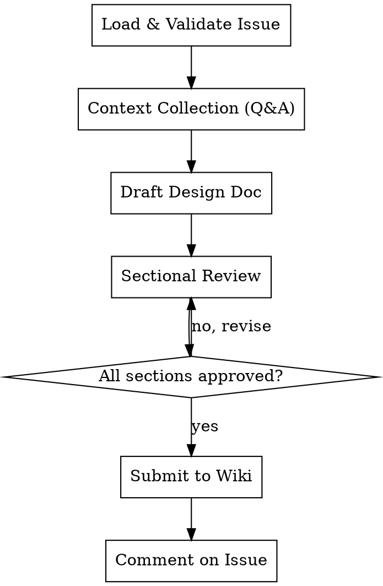

# Beaver Design Doc

Write a design document for a size/L issue in `status/design-pending`. Collects design details through iterative Q&A, writes a structured design doc, submits it as a PR to primatrix/wiki, and comments on the original issue.

**References beaver-engine for:** label ops (Section 4), state machine validation (Section 2), QA loop & HARD-GATE (Section 7), Discovery Triad (Section 8), doc quality constraints (Section 9).

## Prerequisites

- `gh auth status` must succeed
- Argument required: `owner/repo#issue-number`

## Workflow



---

## Phase 1: Load & Validate Issue

### Step 1: Parse argument

Extract `owner`, `repo`, and `issue_number` from the argument. Format: `owner/repo#number`.

If the argument does not match this format, stop and inform user:
- "Invalid argument format. Please use owner/repo#number. Example: primatrix/myproject#42"

### Step 2: Fetch issue

```bash
gh api repos/{owner}/{repo}/issues/{number} --jq '{title, body, state, labels: [.labels[].name]}'
```

### Step 3: Validate labels

Parse labels per engine Section 4. Verify:
- Has `size/L` label
- Has `status/design-pending` label

If either is missing, stop and inform user:
- Missing `size/L`: "This issue is not size/L. Design docs only apply to size/L issues."
- Missing `status/design-pending`: "This issue is not in design-pending status. Cannot start a design doc. Current status: {current_status}"

### Step 4: Extract context from issue body

Parse Goals and Acceptance Criteria from the issue body. Display to user as starting context.

---

## Phase 2: Context Collection (Iterative Q&A)

<HARD-GATE>
Do NOT skip Q&A. Do NOT "derive reasonable assumptions" from the issue body. Do NOT draft any design content until ALL 4 sections have been explored through Q&A with the user per engine §7.3. The issue body is a starting point, NOT sufficient input for a design doc.
</HARD-GATE>

### Phase 2 Step 0: Discovery Triad (engine §8)

Before the first question, execute engine §8 Discovery Triad. Use the issue title + objective as the keyword source. Print the Discovery Brief in the §8.3 format. Do NOT proceed to Phase 2 Section 1 until the Brief has been printed (HARD-GATE per §8 introduction).

### Phase 2 General Rules

Q&A discipline is governed by engine §7 (one question at a time, approval grammar per §7.5, skip-detection per §7.4). Doc quality is governed by engine §9 (bilingual rule §9.1, anti-hallucination §9.2, completeness checklist §9.3 to be presented before each section's `Approved? (y/revise)` prompt).

Design-doc-specific additions:
- For every design decision, ask about trade-offs — "Why this approach instead of alternatives?"
- Encourage the user to use @ to reference files or paste relevant content; the caller MUST `Read` any @-referenced file before continuing.
- When the user mentions an external doc (e.g. wiki page), `WebFetch` or `Read` it before continuing.

Collect information across the following 4 sections one by one. Each section does not have a fixed list of questions; dynamically determine the next question based on Discovery Brief findings and previously-collected answers:

### Section 1: Context & Scope

**Goal:** Understand the environment and boundaries of the project; establish objective background facts

**Starting Points:**
- Begin with the context extracted from the issue body
- Proactively search the codebase for related files, modules, and dependencies
- Ask about missing background information

**Completion Criteria:** A reader should be able to understand, solely from this section, what environment the new system will be built in and what is being built. Concise, objective, and fact-oriented.

### Section 2: Design Goals (Goals & Non-goals)

**Goal:** Clarify goals, non-goals, and success metrics

**Starting Points:**
- Distinguish between "what we want to do" and "what we choose not to do"
- Non-goals are not negative goals (e.g., "the system should not crash"), but rather things that could reasonably be goals but are explicitly chosen not to pursue
- Ask about specific, quantifiable ways to measure success

**Completion Criteria:** Goals cover user scenarios, non-goals have clear boundaries, and success metrics are measurable.

### Section 3: The Design

**Goal:** Architecture, components, interfaces, data flow, trade-offs, plus lightweight test strategy and deployment dependencies

**Starting Points:**
- First search and ask the user to provide existing system information (architecture, code structure, tech stack)
- Explore where new components fit within the existing system (system context diagram)
- Technology choices and rationale
- Interface overview, data storage approach, data flow paths
- Key trade-offs — for every design decision, ask "why this choice"
- Lightweight coverage of test strategy (key test paths, mock strategy)
- Lightweight coverage of deployment and dependencies (deployment approach, external dependencies)

**Key Focus:** Focus on trade-offs. The core value of a design doc lies in recording the trade-offs made during design. Given the context (facts) and goals (requirements), the design should demonstrate why a particular approach best satisfies those goals.

**Completion Criteria:** Architecture boundaries are clear, technology choices are justified, trade-offs are explicitly recorded, and testing and deployment have lightweight coverage.

### Section 4: Alternatives Considered

**Goal:** Collect other approaches the user considered and the reasons they were rejected

**Starting Points:**
- "Before settling on this approach, what other options did you consider?"
- What are the trade-offs of each alternative
- Why the current approach is better given the stated goals

**Completion Criteria:** After reading this section, the reader should understand why the current approach is optimal and why other seemingly viable approaches fell short.

---

## Phase 3: Draft & Sectional Review

### Step 1: Write complete design doc

Based on all collected information, write the design doc using the template below.

### Step 2: Present each section for approval

Present each of the 4 sections individually. For each section:
- Show the section content
- Show the engine §9.3 completeness checklist as a 5-row table; all rows MUST be ☑ before requesting approval. If any row is ☐, revise the section first, re-present, then re-show the table.
- Ask the literal prompt: `Approved? (y/revise)`
- Apply engine §7.5 approval grammar strictly (only `y/yes/ok/approve/approved/lgtm/继续/通过` count). Anything else means revise.
- If user requests changes, revise and re-present
- Only proceed to next section after explicit approval

### Step 3: Final confirmation

After all sections approved, show full document and ask for final confirmation.

---

## Phase 4: Submit to Wiki

### Step 1: Prepare wiki repo

```bash
# If ~/Code/wiki exists, check clean state and pull latest
if [ -d ~/Code/wiki ]; then
  if [ -n "$(git -C ~/Code/wiki status --porcelain)" ]; then
    echo "~/Code/wiki has uncommitted changes. Please commit or stash before proceeding."
    exit 1
  fi
  git -C ~/Code/wiki checkout main && git -C ~/Code/wiki pull
else
  gh repo clone primatrix/wiki ~/Code/wiki
fi
```

### Step 2: Create branch

Generate slug from issue title (lowercase, hyphens, no special chars).

```bash
git -C ~/Code/wiki checkout -B design/{issue_number}-{slug}
```

### Step 3: Write design doc

Ensure the `docs/designs/` directory exists, then write the design doc:
```bash
mkdir -p ~/Code/wiki/docs/designs
```

Write to: `~/Code/wiki/docs/designs/YYYY-MM-DD-{issue-slug}.md`

### Step 4: Commit and push

```bash
git -C ~/Code/wiki add docs/designs/YYYY-MM-DD-{issue-slug}.md
git -C ~/Code/wiki commit -m "docs: add design doc for {owner}/{repo}#{number}"
git -C ~/Code/wiki push -u origin design/{issue_number}-{slug}
```

### Step 5: Create PR

```bash
PR_BODY_FILE=$(mktemp)
cat > "$PR_BODY_FILE" << 'EOF'
## Design Document

Related Issue: {owner}/{repo}#{number}

### Summary
{one-paragraph summary of the design}

🤖 Generated with [Claude Code](https://claude.com/claude-code)
EOF

gh pr create --repo primatrix/wiki \
  --title "Design: {issue_title}" \
  --body-file "$PR_BODY_FILE"

rm "$PR_BODY_FILE"
```

### Step 6: Comment on original issue

```bash
BODY_FILE=$(mktemp)
cat > "$BODY_FILE" << 'BEAVEREOF'
Design document submitted: {PR_URL}

Please review the design document in the PR. Once the review is approved, transition this issue from `status/design-pending` to `status/ready-to-develop`.
BEAVEREOF

gh api repos/{owner}/{repo}/issues/{number}/comments \
  --method POST -F body=@"$BODY_FILE"

rm "$BODY_FILE"
```

### Step 7: Report

Print summary: PR URL, design doc path, issue status (remains `design-pending`).

Then print the next-step hint (do NOT auto-invoke):
```
Next step: after the design doc PR is reviewed and merged, run:
  beaver-decompose {owner}/{repo}#{number}
to break the size/L Task into SubTasks.
```

---

## Design Doc Template

```markdown
---
issue: {owner}/{repo}#{number}
title: {issue_title}
date: {YYYY-MM-DD}
status: design-pending
---

# {Issue Title} Design Document

## 1. Context & Scope

{Objective background facts. The technical environment the new system operates in and what is being built. Concise, no opinions.}

## 2. Design Goals

### 2.1 Goals
{List of goals}

### 2.2 Non-Goals
{Things that could reasonably be goals but are explicitly chosen not to pursue. Not negative goals.}

### 2.3 Success Metrics
{How to measure the success of the design}

## 3. The Design

### 3.1 System Context Diagram
{Where the new system fits within the larger technical landscape, helping readers place the new design in a familiar context}

### 3.2 Core Architecture
{Key components, system boundaries, technology choices and rationale}

### 3.3 Interfaces & Data Flow
{API overview (avoid pasting complete interface definitions; focus on parts relevant to design trade-offs), data storage approach, data flow between modules}

### 3.4 Trade-offs
{Key trade-offs made in the design and their rationale. This is the core value of a design document.}

### 3.5 Test Strategy
{Key test paths, mock strategy — brief description}

### 3.6 Deployment & Dependencies
{Deployment approach, external dependencies — brief description}

## 4. Alternatives Considered

{Other viable approaches and their trade-offs. Focus on the trade-offs of each alternative and why the current approach is better given the stated goals.}

## 5. Open Questions

{Items raised during Q&A that are recorded but not yet decided. For each: question, owner, expected resolution time. Empty list is acceptable but the section header must be present.}

<!-- provenance
- "<fact 1>" ← <source: Discovery D1/D2/D3 line, or QA round N>
- "<fact 2>" ← <source>
-->
```

## Red Flags — STOP If You Catch Yourself Thinking

General red flags are defined in engine §7.4. Below are design-doc-specific additions only:

| Thought | Reality |
|---------|---------|
| "I can derive the trade-offs from the code" | Trade-offs are design decisions, not code facts. They must come from the user. Ask. |
| "I'll skip §5 Open Questions to look more decisive" | Forcing closure on open items causes hallucination later. List them honestly. |
| "The Provenance block is paperwork, I'll skip it" | Provenance is the audit trail that prevents future drift. It is required. |

## Constraints

- Argument is required (must provide owner/repo#issue-number)
- Issue must have `size/L` + `status/design-pending` labels
- One question at a time during Q&A
- All sections must be individually approved before submission
- Issue status stays at `design-pending` — no automatic transition
- Wiki repo cloned to fixed path `~/Code/wiki`
