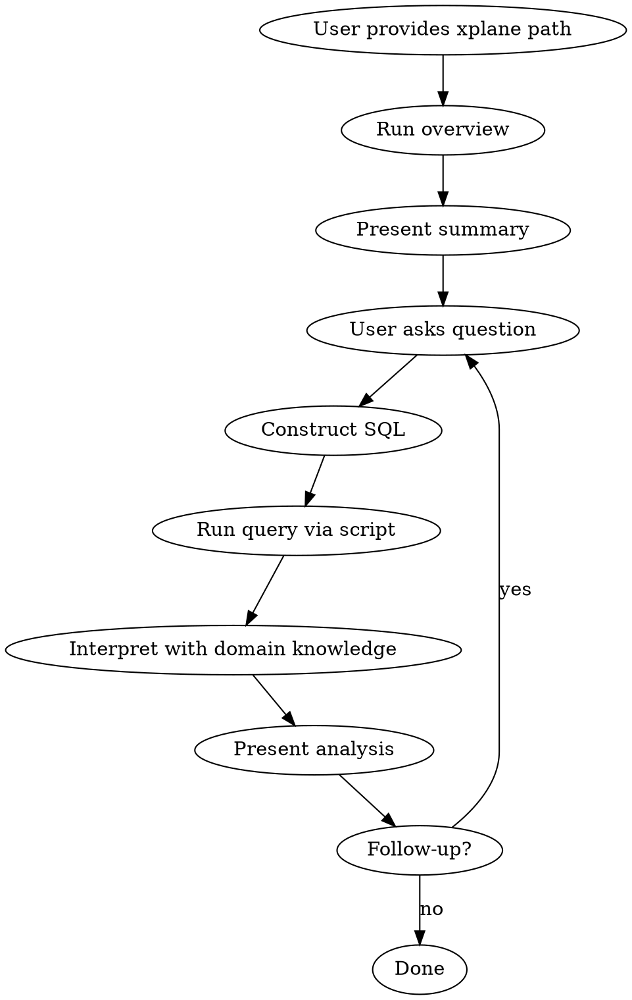

# XPlane Profile Analyzer

Interactive SQL-based analysis of `.xplane.pb` TPU profiling files. Translate the user's natural language questions into SQL queries, run them via the embedded script, and interpret results using TPU profiling domain knowledge.

## Script

The analysis script is at: `plugins/xplane-analyzer/skills/analyze-xplane/scripts/xplane_analyzer.py`

```bash
# High-level overview metrics (run this first)
python scripts/xplane_analyzer.py overview <xplane_path>

# SQL query on the loaded data (returns markdown table)
python scripts/xplane_analyzer.py query <xplane_path> "<sql>"

# Print database schema
python scripts/xplane_analyzer.py schema
```

Supports `.xplane.pb` and `.xplane.pb.gz` files.

## Workflow



1. **Overview first**: Always run `overview` first. Present device count, duty cycle, step timing.
2. **Understand the question**: Map to a query template or construct custom SQL.
3. **Run queries**: Execute SQL, iterate if findings need deeper investigation.
4. **Interpret**: Use domain knowledge below to explain results and suggest optimizations.
5. **Iterate**: Follow up on findings or new user questions.

## SQL Schema

```sql
planes (id INTEGER, name TEXT)
lines  (id INTEGER, plane_id INTEGER, display_id INTEGER, name TEXT, timestamp_ns INTEGER)
events (plane_id INTEGER, line_id INTEGER, name TEXT,
        offset_ps INTEGER, duration_ps INTEGER, start_ps INTEGER, end_ps INTEGER)
```

- `planes` -> `lines` via `plane_id`; `lines` -> `events` via `line_id` + `plane_id`
- Event `name` resolved from `plane.event_metadata` during loading
- All durations/offsets in **picoseconds** (1 ms = 1e9 ps)

## Query Templates

**Top ops by duration:**
```sql
SELECT name, COUNT(*) as count, SUM(duration_ps)/1e9 as total_ms, AVG(duration_ps)/1e9 as avg_ms
FROM events GROUP BY name ORDER BY total_ms DESC LIMIT 20
```

**SyncWait analysis:**
```sql
SELECT name, SUM(duration_ps)/1e9 as total_ms
FROM events WHERE name LIKE '%SyncWait%' OR name LIKE '%sync%'
GROUP BY name ORDER BY total_ms DESC
```

**Device vs Host distribution:**
```sql
SELECT p.name as plane, COUNT(e.name) as event_count, SUM(e.duration_ps)/1e9 as total_ms
FROM events e JOIN planes p ON e.plane_id = p.id GROUP BY p.name
```

**Per-plane timeline:**
```sql
SELECT p.name as plane, l.name as line_name, COUNT(e.name) as events,
       MIN(e.start_ps)/1e9 as start_ms, MAX(e.end_ps)/1e9 as end_ms
FROM events e JOIN planes p ON e.plane_id = p.id
JOIN lines l ON e.line_id = l.id AND e.plane_id = l.plane_id
GROUP BY p.name, l.name
```

**Compute vs memory ratio (device only):**
```sql
SELECT CASE WHEN name LIKE '%SyncWait%' THEN 'memory_wait' ELSE 'compute' END as category,
       SUM(duration_ps)/1e9 as total_ms
FROM events WHERE plane_id IN (SELECT id FROM planes WHERE name LIKE '%device%' OR name LIKE '%tpu%')
GROUP BY category
```

**Event timeline for specific plane:**
```sql
SELECT e.name, e.start_ps/1e9 as start_ms, e.end_ps/1e9 as end_ms, e.duration_ps/1e9 as duration_ms
FROM events e JOIN planes p ON e.plane_id = p.id WHERE p.name LIKE '%PLANE_NAME%'
ORDER BY e.start_ps
```

**Overlapping events (concurrency):**
```sql
SELECT a.name as event_a, b.name as event_b,
       (MIN(a.end_ps, b.end_ps) - MAX(a.start_ps, b.start_ps))/1e9 as overlap_ms
FROM events a, events b
WHERE a.rowid < b.rowid AND a.plane_id = b.plane_id
  AND a.start_ps < b.end_ps AND b.start_ps < a.end_ps
ORDER BY overlap_ms DESC LIMIT 20
```

## Domain Knowledge

### SyncWait / DMA

- **SyncWait** = TPU idle waiting for memory transfers (HBM <-> VMEM)
- High ratio (>20% of device time) = **memory-bound** kernel
- Fix: increase block sizes, enable pipelining, fuse ops, lower precision (bf16/int8)

### Duty Cycle

- duty_cycle = sum(device_event_durations) / (total_duration x device_count)
- **>80%** good | **<50%** investigate (SyncWait? pipeline bubbles? host bottleneck?)

### Roofline

- Arithmetic intensity = FLOPs / bytes_transferred
- TPU v7x ridge point ~ 625 FLOPs/byte
- Below ridge -> memory-bound; above -> compute-bound

### Pipeline Bubbles

- Occur at pipeline start/end during initial/final DMA transfers
- Larger blocks -> fewer iterations -> larger bubble %
- Fix: increase input size, or reduce block size if bubble dominates

### Optimization Priority

1. Make kernel **compute-bound** (overlap DMA with compute)
2. Make kernel **MXU-bound** (matrix ops over elementwise)
3. Optimize **XLA interaction**

### Presenting Results

- Lead with key finding ("kernel is memory-bound — 45% SyncWait")
- Quantify bottleneck (absolute time + percentage)
- Explain in hardware terms
- Suggest 2-3 actionable optimizations ranked by impact
- If ambiguous, run more queries before concluding
